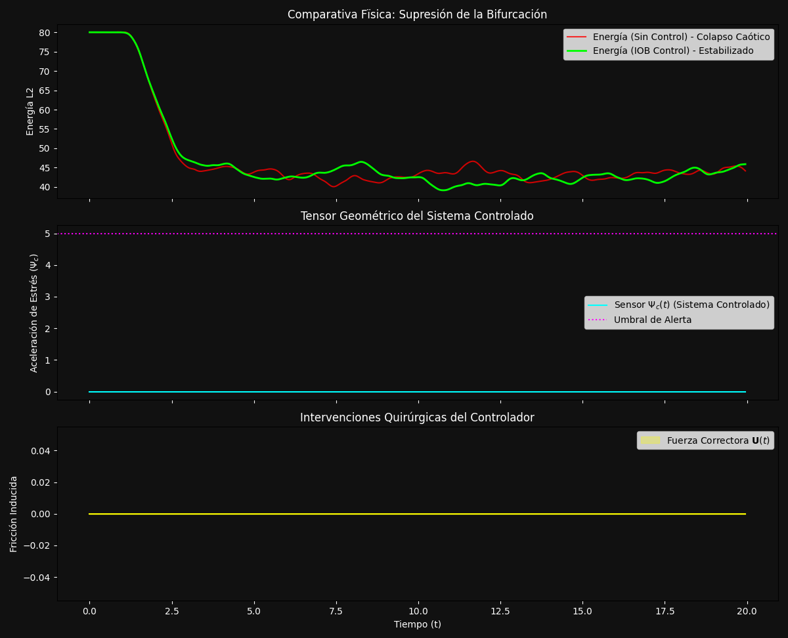
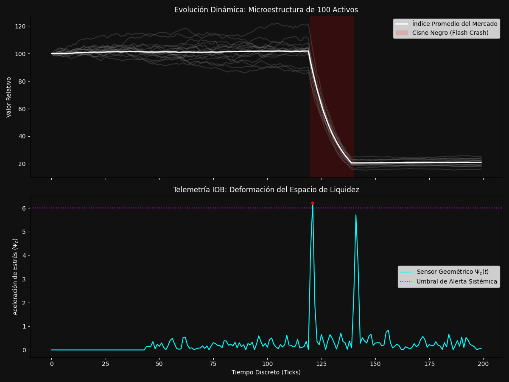

# IOB-Solve: Topological Integrity Operator Framework

[](https://doi.org/10.5281/zenodo.20016070)
[](https://www.python.org/downloads/)
[](https://opensource.org/licenses/MIT)
[](https://github.com/JoaKnut/iobsolve)

**IOB-Solve** es un framework de análisis numérico de alto rendimiento basado en el **Operador de Integridad de Bisagra (IOB)**. Está diseñado para detectar, medir y controlar rupturas en la variedad geométrica de sistemas complejos *antes* de que ocurran catástrofes cinéticas, fallos estructurales o colapsos sistémicos.

En lugar de depender de interpolaciones pasadas o modelos de aprendizaje profundo que requieren entrenamiento masivo, el IOB evalúa el *Laplaciano Geométrico* instantáneo del espacio de fases, otorgando **Latencia Positiva** (alerta predictiva temprana) frente a singularidades inminentes.

---

## 🔬 Arquitectura Core

El corazón de la librería (`iobsolve.core`) implementa el funcional de estrés topológico $\Psi_c(t)$.

*   **Aceleración de Deformación ($\Psi_c$):** Mide la tasa de cambio de la curvatura del espacio en tiempo real.
*   **Muestreo de Importancia Geométrico (GIS):** Elude el cálculo prohibitivo de matrices Jacobianas densas $\mathcal{O}(N^3)$ en sistemas de alta dimensionalidad. Reduce la evaluación espacial a $\mathcal{O}(M)$ donde $M \ll N$, permitiendo telemetría en milisegundos.
*   **Auto-Tuning $L_{metric}$:** Un calibrador dinámico que ajusta automáticamente la resolución óptica ($L$) aprendiendo la varianza del ruido basal del sistema durante una fase de "warm-up". Previene falsos positivos y adapta la sensibilidad sin requerir intervención manual (Magic Number Tuning).

---

## 📦 Ecosistema de Plugins

IOB-Solve es altamente modular, permitiendo aplicar cirugía topológica a diversos dominios de la ingeniería y las ciencias exactas.

### 1. Dynamics & Control (`iobsolve.plugins.control`)
Supresión activa de bifurcaciones en fluidos no-lineales y sistemas caóticos (Ej. Modelo de Lorenz-96 en 100 dimensiones).
*   **Topological Surgeon:** Actúa como un amortiguador geométrico, inyectando un vector de control $\mathbf{U}(t)$ *únicamente* cuando $\Psi_c$ supera el umbral crítico. Guía al sistema de vuelta a la variedad estable con un gasto energético virtualmente nulo en régimen basal.


*Comparativa física y telemetría de IOB en el control de un sistema hiper-caótico. Observa cómo el funcional predictivo $\Psi_c$ (Cyan) guía la inyección de la fuerza correctora.*

### 2. Network Security (`iobsolve.plugins.network`)
Prevención de ataques volumétricos y asimétricos (DDoS) mediante middleware asíncrono para frameworks ASGI (FastAPI, Starlette).
*   **Z-Score Surgery:** Trata el tráfico de red como un flujo topológico continuo. Cuando la latencia y las peticiones deforman el espacio de servicio de forma anómala, el IOB aísla a los tensores asimétricos (IPs hostiles) en $\mathcal{O}(1)$, manteniendo intacta la experiencia de los usuarios legítimos.

### 3. Financial Stability (`iobsolve.plugins.finance`)
Detección anticipada de colapsos de liquidez (*Flash Crashes*) en mercados de alta frecuencia (HFT) o portafolios de riesgo.
*   **Market Monitor:** Analiza la matriz estocástica de retornos (Movimiento Browniano). El IOB detecta cuándo la microestructura de liquidez se rompe (las trayectorias de ruido blanco comienzan a sincronizarse en caída) alertando fracciones de segundo *antes* de que el precio del activo refleje el desplome total en el order book.


*Detección de un Flash Crash estocástico. El tensor geométrico IOB dispara una señal masiva de estrés (gráfico inferior) antes de que la caída del precio (gráfico superior) se materialice completamente.*

### 4. Advanced Math (`iobsolve.plugins.math`)
Localización topológica de raíces y polos en el plano complejo puro.
*   **IOB-QuadTree:** Combina el Teorema del Flujo Topológico con subdivisión perimetral y refinamiento Newtoniano amortiguado (*Damped Newton*). Aísla semillas hiper-trascendentales y logra precisiones del límite de hardware (15/16 decimales) en microsegundos, evadiendo el *Overflow* (*NaNs*) inherente a funciones exponenciales complejas.

---

## 🚀 Instalación y Uso Rápido

*(Paquete en preparación para release en PyPI)*

Para probar el framework localmente, clona el repositorio e instala las dependencias de desarrollo:
```bash
git clone [https://github.com/JoaKnut/iobsolve.git](https://github.com/JoaKnut/iobsolve.git)
cd iobsolve
pip install -e ".[dev]"
```

### Ejemplo: Auto-Calibración en Ciberseguridad (DDoS Shield)

Integra la protección geométrica en tu API con 3 líneas de código:
```python
from fastapi import FastAPI
from iobsolve.plugins.network.ddos_shield import IOBASGIMiddleware

app = FastAPI()

# El IOB aprenderá la latencia basal del servidor automáticamente (l_metric="auto")
# durante los primeros ciclos antes de armar las defensas.
app.add_middleware(
    IOBASGIMiddleware,
    alert_threshold=12.0,
    l_metric="auto", 
    quarantine_sec=120
)
```

---

## 🧪 Suite de Pruebas (Tests) y Reproducibilidad

La carpeta `/tests` contiene simulaciones y scripts de validación empírica para cada módulo del framework.

### 💡 Nota sobre `L_metric` y Auto-Calibración
Los tests están diseñados para demostrar la eficiencia de la calibración automática (`l_metric="auto"`). En los scripts de ejecución, observarás cómo el sistema ajusta la resolución óptica dinámicamente.

**Valores sugeridos si decides usar `L_metric` en modo manual:**
*   **Redes (DDoS):** **0.5 a 1.5** (Ruido asíncrono de alta latencia).
*   **Finanzas (Flash Crash):** **0.001 a 0.05** (Micro-variaciones porcentuales).
*   **Dinámica (Caos):** **0.05 a 0.2** (Determinismo con alta sensibilidad a condiciones iniciales).
*   **Matemáticas (Raíces):** **1e-4 a 0.01** (El Auto-Tuning no aplica aquí por ser un entorno de evaluación estático y determinista).

### Estructura de Pruebas

*   **`test_singularities.py` (Módulo Matemático):** Ejecuta el algoritmo `IOB-QuadTree` sobre una función trascendental compleja. Muestra la precisión extrema del límite de hardware lograda tras la convergencia de la bisección de flujo.
*   **`test_ddos_attack.py` (Módulo de Ciberseguridad):** Levanta un servidor FastAPI local e inyecta tráfico legítimo mezclado con ráfagas de ataques asimétricos. Demuestra cómo el IOB aprende la línea base (auto-calibración) y bloquea selectivamente a la IP atacante sin falsos positivos.
*   **`test_chaos_control.py` y `test_lorenz96.py` (Módulo de Control y Dinámica):** Ejecutan sistemas hiper-caóticos (como el modelo Lorenz-96 en alta dimensión). `test_lorenz96.py` actúa como benchmark del sensor, mientras que `test_chaos_control.py` muestra la aplicación de "Cirugía Topológica", estabilizando la energía del sistema mediante inyecciones de fricción calibradas.
*   **`test_flash_crash.py` (Módulo Financiero):** Genera un portafolio sintético y desencadena un *shock* sistémico de correlación. Demuestra la capacidad del IOB para disparar alertas milisegundos *antes* de que la caída sea visible macroscópicamente.

---

## 📜 Publicaciones y Teoría

El fundamento matemático de este framework (Operador de Integridad de Bisagra, Muestreo GIS y Saturación de Curvatura) se detalla en nuestro documento principal de investigación:

📄 **[Leer la Teoría Fundamental (PDF)](./paper/IOB_Solve_Teoria.pdf)**

> **💡 Nota sobre las Aplicaciones Prácticas:** 
> Mientras que el documento académico establece el rigor topológico y la validación en sistemas continuos y matemáticas puras, los módulos de **Finanzas (Flash Crashes)** y **Redes (DDoS)** incluidos en esta librería son extensiones experimentales (*Proof of Concept*). Su propósito es demostrar empíricamente la universalidad del operador IOB al trasladar el concepto de "curvatura del espacio" a entornos estocásticos discretos y series temporales asíncronas.

*Investigación desarrollada por Joaquín Knuttzen.*